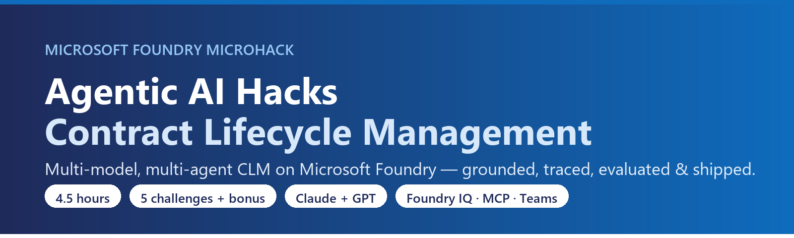
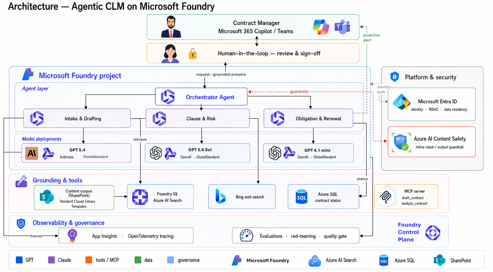
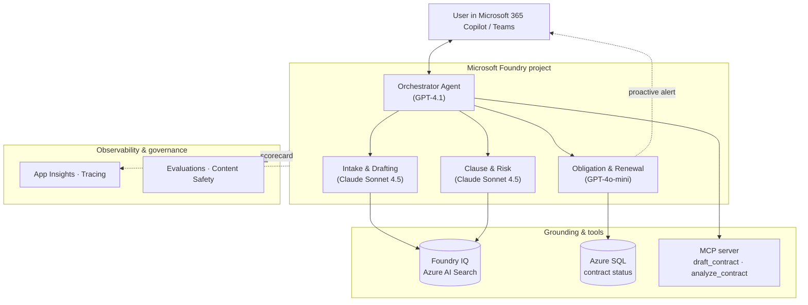

# Agentic AI Hacks · Contract Lifecycle Management

Build a **multi-model, multi-agent** contract assistant on **Microsoft Foundry** — grounded with
**Foundry IQ**, traced and evaluated, exposed as an **MCP server**, and published to **Microsoft 365
Copilot & Teams** with proactive renewal alerts.

> A 4.5-hour microhack · 5 challenges (+ optional bonus) · code-first (Python) · GitHub Codespaces.

---

## The scenario — Contoso Global

Contoso Global signs hundreds of contracts a month. Legal & Procurement drown in intake, clause
review, and renewals: ~17-day turnaround and ~11% of auto-renewals missed. Contracts are scattered
across SharePoint, email, and legacy systems, and comparing a counterparty draft to the enterprise
standard is slow and manual.

You'll build an **Agentic CLM** system: an **Orchestrator** coordinating grounded specialist agents
that draft from approved templates, extract and risk-score clauses, answer cited questions over the
corpus, and proactively alert on renewals — all with **human sign-off and full tracing**.

---

## Architecture



<details>
<summary>Mermaid source</summary>



</details>

> 📐 **Editable diagrams:** the architecture (above) and an end-to-end **[user journey](docs/diagrams/)**
> are available as **draw.io** *and* **Excalidraw** sources in **[`docs/diagrams/`](docs/diagrams/)**.

### Multi-model fleet

Anthropic **Claude is generally available in Microsoft Foundry** (model catalog **and** Foundry Agent
Service), Azure-hosted with Entra identity, consolidated billing, and data-residency controls — so
specialists run on Claude while orchestration runs on GPT, all inside **one** Foundry project.

| Agent | Model | Why this model |
|-------|-------|----------------|
| **Orchestrator** | GPT-4.1 | Fast, deterministic routing + tool/hand-off calls |
| **Intake & Drafting** | **Claude Sonnet 4.5** | High-fidelity, template-grounded drafting |
| **Clause & Risk** | **Claude Sonnet 4.5** | 200K-context clause comparison + nuanced risk rationale |
| **Obligation & Renewal** | GPT-4o-mini | Cheap, high-frequency structured extraction + alerts |

---

## What you'll learn

- **Foundry Agent Service** — build grounded, tool-using agents (on GPT **and** Claude).
- **Foundry IQ** — agentic retrieval over Azure AI Search with cited answers.
- **Tools & MCP** — function tools (Azure SQL) and exposing the workflow as an MCP server.
- **GenAIOps** — OpenTelemetry tracing to App Insights, evaluation scorecards, a quality gate, and a
  **Claude-vs-GPT bake-off**.
- **Multi-agent orchestration** — an orchestrator delegating to specialists.
- **Publish** — ship the assistant to **M365 Copilot & Teams** and push **proactive alerts**.
- **Responsible AI** *(bonus)* — red-team the agent, add Content Safety/PII guardrails, and gate
  releases on a **quality + safety** check in CI.

---

## Challenges

| # | Challenge | Focus | Duration |
|---|-----------|-------|----------|
| [0](challenge-0/) | Resource deployment · Codespaces · `.env` · corpus seeding | Setup | 30 min |
| [1](challenge-1/) | Intake & Drafting agent + Foundry IQ + tools | Grounding · tools · guardrails | 60 min |
| [2](challenge-2/) | Observability, tracing & evaluation | Tracing · eval | 60 min |
| [3](challenge-3/) | Clause & Risk agent + Orchestrator + MCP server | Orchestration · MCP | 60 min |
| [4](challenge-4/) | Publish to M365 Copilot & Teams + proactive alerts | Publish · alerts | 60 min |
| [5](challenge-5/) 🧪 | *Bonus:* Safety, Red-Teaming & Continuous Eval | Responsible AI · CI gate | optional |

## Suggested agenda (4.5h)

| Time | Activity |
|------|----------|
| 09:00 – 10:00 | Tech Talk |
| 10:00 – 12:30 | Team hacking — Challenges 0, 1, 2 |
| 12:30 – 13:30 | Lunch break |
| 13:30 – 15:30 | Team hacking — Challenges 3, 4 |
| 15:30 – 16:00 | Final discussion / wrap up |

> 🧪 **Bonus [Challenge 5](challenge-5/)** (Safety, Red-Teaming & Continuous Eval) is optional — for
> teams who finish early. It doesn't fit inside the 4.5h; tackle it if you have time or as follow-up.

> 👩‍🏫 **Running this event?** See the **[Coach & Facilitator Guide](docs/coach-guide.md)** — before-the-day
> checklist, run-of-show, per-challenge blockers & hints, and a reset/recovery playbook.

---

## Prerequisites

- An **Azure subscription** with rights to create a Foundry project and deploy models (GPT **and**
  Anthropic Claude — confirm Claude availability in your target region via the model catalog).
- **GitHub account** (to fork + open in Codespaces).
- Basic Python. No local install needed — the devcontainer has everything.
- For Challenge 4: a Microsoft 365 tenant where you can sideload a Teams app (or a coach-provided one).

## Getting started

1. **Fork** this repo, then **Code → Codespaces → Create codespace**. The devcontainer installs
   Python 3.11, Azure CLI, `azd`, Node, and `requirements.txt` automatically.
2. `az login` (and `azd auth login` if you use the `azd up` path)
3. Do **[Challenge 0](challenge-0/)** to deploy resources and seed the corpus — provision with
   **`azd up`** (Bicep in `infra/`) or the **`scripts/deploy`** script. Either autofills your `.env`.
4. Work through Challenges 1 → 4.

---

## Repo layout

```
.
├── .devcontainer/            # Codespaces definition
├── infra/                    # Bicep for `azd up` (main.bicep + resources.bicep)
├── azure.yaml                # azd config (provision + write-.env hook)
├── src/clm_common/           # shared config + Foundry client helpers
├── scripts/                  # deploy, seed corpus, smoke test, write .env
├── data/                     # CLM corpus + evaluation dataset
├── challenge-0/ … challenge-4/   # one folder per challenge (README + code)
├── challenge-5/              # bonus: safety, red-teaming & CI eval gate
├── images/                   # banner + rendered architecture diagram
└── docs/                     # coach guide + marketing collateral + editable diagrams
```

> Generate images locally with `python scripts/make_banner.py` and
> `mmdc -i scripts/architecture.mmd -o images/architecture.png -b white -s 3 -w 1600`. Regenerate the
> Teams app icons with `python scripts/make_icons.py`.

Each challenge README follows the same anatomy: **🎯 Objective · 🧭 Context · ✅ Tasks · ✔️ Success
criteria · 🚀 Go Further · 🛠️ Troubleshooting · 🧠 Reflection**.

> **On "solutions":** each challenge folder ships a **complete, working reference implementation** —
> there's no separate `solutions/` folder. The challenge is to **run it, understand *why* it works, and
> extend it** (the 🚀 Go Further section), not to type it from a blank file. The code *is* the answer key.

---

> **Guardrail:** the agents assist Legal & Procurement — they draft, analyze, and recommend, but they
> **do not give legal advice** and **never execute a contract**. A human always approves and signs.

---

## Contributing

This project welcomes contributions and suggestions. Most contributions require you to agree to a
Contributor License Agreement (CLA) declaring that you have the right to, and actually do, grant us
the rights to use your contribution. For details, visit [https://cla.opensource.microsoft.com](https://cla.opensource.microsoft.com).

When you submit a pull request, a CLA bot will automatically determine whether you need to provide
a CLA and decorate the PR appropriately (e.g., status check, comment). Simply follow the instructions
provided by the bot. You will only need to do this once across all repos using our CLA.

This project has adopted the [Microsoft Open Source Code of Conduct](https://opensource.microsoft.com/codeofconduct/).
For more information see the [Code of Conduct FAQ](https://opensource.microsoft.com/codeofconduct/faq/) or
contact [opencode@microsoft.com](mailto:opencode@microsoft.com) with any additional questions or comments.

## Trademarks

This project may contain trademarks or logos for projects, products, or services. Authorized use of Microsoft
trademarks or logos is subject to and must follow
[Microsoft's Trademark & Brand Guidelines](https://www.microsoft.com/legal/intellectualproperty/trademarks/usage/general).
Use of Microsoft trademarks or logos in modified versions of this project must not cause confusion or imply Microsoft sponsorship.
Any use of third-party trademarks or logos are subject to those third-party's policies.