# Challenge 0 · Setup & Foundry Foundations

Welcome to your very first challenge! Here you lay the foundation for the whole microhack: you'll
deploy the Azure resources, wire up your development environment, and seed the contract corpus the
later challenges build on. By the end you'll have the full **Microsoft Foundry** environment
running — with **zero local install** — so the rest of the hack is pure agent-building.

If something isn't working as expected, please let your coach know.

> **⏱️ Duration:** ~30 min

> **📋 Prerequisites:**
> - An **Azure subscription** with rights to create a Foundry project and deploy GPT **and** Anthropic Claude models.
> - A **GitHub account** (to fork the repo and open it in Codespaces).
> - **GitHub Codespaces** access — everything runs in the browser; no local tooling required.

> 🧩 **How to use this challenge:** the provisioning is **scripted for you** (`azd up` *or* the
> `scripts/deploy` script). **Run it, then confirm you understand what got created** — the Foundry
> project, the three-model fleet, and the search index the later challenges depend on. Stuck? The
> scripts *are* the answer key.

## 🎯 Objective

- Provision the Azure resources needed for the upcoming challenges into a single resource group.
- Seed the **Contoso Global** contract corpus from a **SharePoint** document library into Azure AI
  Search (via a SharePoint Online indexer) so **Foundry IQ** can ground the agents with **cited** answers.
- Smoke-test the environment so you *know* both a GPT and the Claude deployment run before you build.

## 🧭 Context and Background

Everything runs from **GitHub Codespaces** using the devcontainer in this repo (Python 3.11, Azure
CLI, `azd`, Node). A single command — **`azd up`** (Bicep in [`infra/`](./infra/)) or the
**`scripts/deploy`** script — provisions everything below into **one resource group** and autofills
your `.env`.

The following image illustrates the complete setup — every Azure resource, the LLM model fleet, and
the identity + delivery plane around them:


All resources reside in a **single resource group** (default name `rg-clm-microhack`, region
`swedencentral`):

- A **Microsoft Foundry** account (Azure AI Services · S0) with a **Foundry project** (`clm-project`)
  — one identity, billing, tracing, and governance plane for the whole system.
- Three **model deployments** — the multi-model fleet the agents run on: **`gpt-5.3`**,
  **`gpt-4o-mini`**, and **`claude-sonnet-4-5`** (Claude is GA in Microsoft Foundry).
- **Azure AI Search** (Basic) — the backing store for the **Foundry IQ** knowledge base (`clm-corpus`
  index, `clm-search` connection).
- **SharePoint document library** *(bring-your-own · Microsoft 365, not an Azure resource)* — the source
  contract corpus. An Azure AI Search **SharePoint Online indexer** crawls it into the `clm-corpus` index.
- **Application Insights** + a **Log Analytics** workspace — OpenTelemetry tracing (Challenge 2).
- *(Optional)* **Azure SQL Database** (Basic) — backs the contract-status / renewal function tool.

Identity is **keyless** for Azure data planes: system-assigned managed identities plus Microsoft Entra
ID RBAC (Azure AI Developer, Cognitive Services User, Search data roles) — all assigned for you by
`azd up`. *(The SharePoint indexer authenticates with a separate Entra app registration — see below.)*

<details>
<summary><strong>📦 Resource inventory</strong> (what gets created)</summary>

| Resource | Type / SKU | Default name | Purpose |
|----------|------------|--------------|---------|
| Foundry account | Azure AI Services · `S0` | `clmfoundry****` | Hosts the project + model deployments |
| Foundry project | AI Foundry project | `clm-project` | Agents, connections, tracing |
| Azure AI Search | `Basic` | `clmsearch****` | Foundry IQ knowledge base (`clm-corpus` index) |
| SharePoint library *(BYO · M365)* | document library | *your site* | Source contract corpus → AI Search indexer |
| Application Insights | `web` | `clm-appinsights****` | OpenTelemetry traces |
| Log Analytics | `PerGB2018` | `clm-logs****` | Backing store for App Insights |
| Azure SQL *(optional)* | `Basic` | `clmsql****` | Contract status / renewal dates |

`****` is a short random token so globally-unique names don't collide.

</details>

<details>
<summary><strong>🤖 Model fleet</strong> (the LLM deployments)</summary>

| Deployment | Model · format | SKU | Agent it powers | Challenge |
|------------|----------------|-----|-----------------|-----------|
| `gpt-5.3` | OpenAI `gpt-5.3-chat` (version per your region's catalog, e.g. `2026-03-03`) | GlobalStandard · 30 | **Orchestrator** — routing + hand-offs | C3 |
| `claude-sonnet-4-5` | Anthropic `claude-sonnet-4-5` (v`20250929`, Azure-hosted) | GlobalStandard · 20 | **Intake & Drafting** + **Clause & Risk** | C1, C3 |
| `gpt-4o-mini` | OpenAI `gpt-4o-mini` (`2024-07-18`) | GlobalStandard · 30 | **Obligation & Renewal** — cheap, high-frequency | C3 |

> Specialists run on **Claude** while orchestration runs on **GPT** — all inside **one** Foundry
> project. That's the multi-model fleet you'll build agents on.

</details>

<details>
<summary><strong>📚 CLM corpus</strong> (the data you seed)</summary>

`python scripts/seed_corpus.py` creates an Azure AI Search **SharePoint Online indexer** that crawls the
[`data/`](./data/) corpus (hosted in your SharePoint library) into Azure AI Search so Foundry IQ can
ground answers with citations. The contract corpus is delivered as **PDF** (the indexer extracts the
text at crawl time); regenerate the PDFs with `python scripts/make_corpus_pdfs.py` (needs
`pip install reportlab`) and upload them to the library:

| Folder | Contents | Used by |
|--------|----------|---------|
| `contract_templates/` | Approved NDA / MSA / SOW templates (PDF) | Intake & Drafting (C1) |
| `clause_library/` | `standard_clauses.pdf` — standard positions CL-01…CL-12 | Clause & Risk (C3) |
| `policies/` | Contracting policy + delegation-of-authority matrix (PDF) | All agents (grounding + guardrails) |
| `contracts/` | 5 executed contracts (PDF), one per `contracts_seed.json` row | Clause & Risk (C3), tools (C1/C4) |
| `counterparty_drafts/` | `acme_msa_draft.pdf`, `globex_nda_redline.pdf` — inbound drafts full of red flags | Clause & Risk (C3) |
| `playbooks/` | `negotiation_playbook.pdf` — fallback positions | Intake & Drafting (C1) |
| `evaluation/` | `evaluation_dataset.jsonl` — 16 labelled cases | Evaluation (C2) |

</details>

## ✅ Tasks

> [!NOTE]
> **New to Azure or the terminal? Read this first.** This challenge is 100% click-and-paste — you
> never write code. Do the tasks **in order**, and after each command check the **✅ You should see**
> block before moving on. The **📸 Screenshot slot** boxes show *what the screen looks like* at that
> moment (swap in your own screenshots later). If a step doesn't match, jump to
> [🛠️ Troubleshooting](#️-troubleshooting) — don't push past a red error.

**Before you begin — tick these off:**

- [ ] You can sign in to [github.com](https://github.com).
- [ ] You can sign in to the [Azure Portal](https://portal.azure.com) with an account that can **create resources**.
- [ ] Your Azure subscription can deploy **GPT _and_ Anthropic Claude** models (ask your coach if unsure).
- [ ] You have ~30 minutes and a stable connection (provisioning takes 5–10 min on its own).

### Task 1 · Fork the repository

A **fork** is your own copy of this repo where your changes and progress are saved.

1. Go to **[github.com/glejdis/microhack-aiagents/fork](https://github.com/glejdis/microhack-aiagents/fork)**.
2. Leave **Owner** as your username and keep the repo name.
3. Click the green **Create fork** button.

> 📸 **Screenshot slot — what you'll see:** the GitHub *Create a new fork* page with the green **Create fork** button.
>
> 

✅ **You'll know it worked when:** the page reloads at `github.com/<your-username>/microhack-aiagents` (your username, not `glejdis`, in the URL).

> [!IMPORTANT]
> **Already forked this repo a while ago?** Your fork can fall **behind** the original and miss recent
> fixes (for example the model/region fix in Challenge 0). Before you deploy, **sync your fork**: open
> your fork on GitHub → click **"Sync fork" → "Update branch"**, or run
> `gh repo sync <your-username>/microhack-aiagents --branch main`. Then, inside your
> Codespace/clone, run `git pull`. Skipping this is the #1 cause of a `DeploymentModelNotSupported`
> error in Task 4.

---

### Task 2 · Launch the development environment

**GitHub Codespaces** is a full VS Code + terminal running in your browser — no local installs, no
"works on my machine." Everything below runs inside it.

1. On **your fork's** main page, click the green **`< > Code`** button.
2. Open the **Codespaces** tab.
3. Click **Create codespace on `main`**.
4. Wait for the build to finish — it auto-runs `pip install -r requirements.txt`. First build takes
   a few minutes. When the terminal at the bottom stops scrolling and shows a prompt, it's ready.

> 📸 **Screenshot slot — what you'll see:** the **Code → Codespaces → Create codespace on main** menu, then the ready Codespace.
>
> 
> 

✅ **You'll know it worked when:** you see a VS Code editor in the browser with a **Terminal** panel
at the bottom showing a ready prompt (e.g. `@your-username ➜ /workspaces/microhack-aiagents (main) $`).

> [!NOTE]
> If GitHub Codespaces is not enabled in your organization, see [enabling or disabling Codespaces](https://docs.github.com/en/codespaces/managing-codespaces-for-your-organization/enabling-or-disabling-github-codespaces-for-your-organization), or create a [free personal GitHub account](https://github.com/signup). The Free plan includes 120 core-hours/month.

> [!TIP]
> While the Codespace builds, skim the [hackathon scenario & architecture](../README.md#the-scenario--contoso-global) so the pieces you deploy here make sense.

---

### Task 3 · Log in to Azure

Now connect the terminal to your Azure account. In the Codespace **Terminal**, type this and press Enter:

```bash
az login --use-device-code
```

It prints a short code and a URL. **Open [microsoft.com/devicelogin](https://microsoft.com/devicelogin)**
in a new browser tab, paste the code, and sign in with your Azure account.

> 📸 **Screenshot slot — what you'll see:** the device-login page where you paste the code from the terminal.
>
> 

✅ **You should see** (your subscriptions listed, then a table like this):

```text
Retrieving tenants and subscriptions for the selection...
[Tenant and subscription selection]
No     Subscription name        Subscription ID                       Tenant
-----  -----------------------  ------------------------------------  -------------
[1] *  My Azure Subscription    2942123c-....-793528767894            Contoso
```

Then pick the subscription you want to deploy into (replace the id with yours):

```bash
az account set --subscription "<your-subscription-id>"
```

> [!TIP]
> List your subscriptions any time with `az account list --output table`. Copy the **Subscription ID**
> (the long `xxxxxxxx-xxxx-...` value), not the name.

---

### Task 4 · Deploy the resources

> [!IMPORTANT]
> Depending on the setup for your event, the Azure resources may already be provisioned for you — in
> which case you can **skip to Task 6**. Check with your coach what applies.

Choose a region that offers **all three** models. This repo's infra is pre-pinned to models that are
available in **`swedencentral`** today (`gpt-5.3-chat`, `gpt-4o-mini`, `claude-sonnet-4-5`), so
**`swedencentral` is the safe default** — use it unless your coach says otherwise. Then pick **one** option:

> [!TIP]
> **Want to double-check what your subscription offers in a region?** Run
> `az cognitiveservices model list --location swedencentral --output table` and look for the model
> names above. If you switch regions and a model isn't listed, that's what causes a
> `DeploymentModelNotSupported` error — see [🛠️ Troubleshooting](#️-troubleshooting).

> [!IMPORTANT]
> **Preflight (30 seconds, saves 10 minutes):** confirm your checkout has the current model pins
> *before* you provision. Run:
> ```bash
> grep -n "gptOrchestrator" challenge-0/infra/resources.bicep
> ```
> ✅ You should see `gpt-5.3-chat` and version `2026-03-03`.
> ❌ If you instead see `2025-11-01` (or a bare `gpt-5.3`), your fork/checkout is **stale** — go back
> and **[sync your fork](#task-1--fork-the-repository)** + `git pull`, then re-run this check. Deploying
> a stale template is what triggers `DeploymentModelNotSupported`.

<details open>
<summary><strong>Option A — <code>azd up</code></strong> (recommended · Bicep in <code>infra/</code>)</summary>

**Step 4a — sign `azd` in** (separate from `az login` above):

```bash
azd auth login
```

**Step 4b — provision everything** with one command:

```bash
azd up
```

`azd up` asks you **three questions** the first time. Answer them like this:

| Prompt | What to type |
|--------|--------------|
| `Enter a new environment name` | anything short + lowercase, e.g. **`clm-microhack`** |
| `Select an Azure Subscription` | the subscription you set in Task 3 (arrow keys → Enter) |
| `Select an Azure location` | **`Sweden Central`** (start typing `sweden` to filter) |

> 📸 **Screenshot slot — what you'll see:** the three `azd up` prompts (environment name, subscription, region).
>
> 

Then it provisions for **5–10 minutes**. `azd up` deploys the Bicep in [`infra/`](./infra/), assigns the
RBAC roles the later challenges need, creates the `clm-search` Foundry IQ connection, and runs the
`postprovision` hook (`scripts/write_env.py`) to write your `.env`.

> 📸 **Screenshot slot — what you'll see:** the green **SUCCESS** summary with the deployed resources and outputs.
>
> 

✅ **You should see** (names/values will differ) — the key line is `SUCCESS`:

```text
  (✓) Done: Deploying service ...
Deploying services (azd deploy)

  Provisioning Azure resources (azd provision)
  Resource group: rg-clm-microhack
  ...
SUCCESS: Your up workflow to provision and deploy to Azure completed in 8 minutes.
```

❌ **If it fails with `DeploymentModelNotSupported`** — first check you're **not on a stale fork**:
run `grep -n "gptOrchestrator" challenge-0/infra/resources.bicep` and confirm you see `gpt-5.3-chat`
and `2026-03-03` (if you see `2025-11-01`, [sync your fork](#task-1--fork-the-repository) + `git pull`).
If your checkout is current, then a model/version simply isn't offered in your region: this repo is
already fixed for `swedencentral`, so switch back to it, or update the versions in
[`infra/resources.bicep`](./infra/resources.bicep). See [🛠️ Troubleshooting](#️-troubleshooting).

To also provision Azure SQL:

```bash
azd env set DEPLOY_SQL true
azd env set SQL_ADMIN_PASSWORD '<StrongP@ssw0rd!>'
azd up
```

</details>

<details>
<summary><strong>Option B — deploy script</strong> (<code>az</code> CLI)</summary>

```bash
LOCATION=swedencentral ./scripts/deploy.sh          # add --with-sql to also provision Azure SQL
```

> Windows (outside Codespaces): `./scripts/deploy.ps1` (`-WithSql` optional).

</details>

<details>
<summary><strong>Option C — one-click <em>Deploy to Azure</em> / plain ARM</strong> (<code>infra/azuredeploy.json</code> · no <code>azd</code>)</summary>

Prefer a portal button or a pure `az` deploy with no `azd`? [`infra/azuredeploy.json`](./infra/azuredeploy.json)
is a self-contained ARM template **compiled from the same Bicep** — it creates the same
`rg-clm-microhack` resource group and resources.

[](https://portal.azure.com/#create/Microsoft.Template/uri/https%3A%2F%2Fraw.githubusercontent.com%2Fglejdis%2Fmicrohack-aiagents%2Fmain%2Fchallenge-0%2Finfra%2Fazuredeploy.json)

The button opens a **subscription-scoped** custom deployment — pick your subscription and
region and it provisions everything (no resource-group picker; the template creates
`rg-clm-microhack` itself). Or from the CLI:

```bash
az deployment sub create \
  --name clm-microhack \
  --location swedencentral \
  --template-file challenge-0/infra/azuredeploy.json \
  --parameters environmentName=clm-microhack location=swedencentral \
               principalId=$(az ad signed-in-user show --query id -o tsv)
```

> Passing your `principalId` assigns the data-plane roles (Search Index Data) you need to
> seed the corpus. Add `deploySql=true sqlAdminPassword='<StrongP@ssw0rd!>'` to also
> provision Azure SQL.

Unlike `azd up`, this path does **not** auto-write `.env`. Populate it from the deployment
outputs (use the same `--name` you deployed with):

```bash
python scripts/write_env.py --deployment clm-microhack
```

</details>

Options A and B write a populated **`.env`** automatically; Option C writes it via the
`write_env.py --deployment` step above. ⏱️ Provisioning takes ~5–10 minutes.

---

### Task 5 · Verify your resources

Let's confirm everything landed. Do all three checks:

**5a — Resource group in the Azure Portal.** Open the [Azure Portal](https://portal.azure.com/) →
search **`rg-clm-microhack`** → click it. You should see ~7 resources (Foundry account, Azure AI Search,
Application Insights, Log Analytics, and the model deployments live inside the Foundry account).

> 📸 **Screenshot slot — what you'll see:** the `rg-clm-microhack` overview listing the resources.
>
> 

**5b — Model deployments in the Foundry portal.** Open [ai.azure.com](https://ai.azure.com) → select
your **`clm-project`** → **Models + endpoints**. Confirm **three** deployments show **Succeeded**:
`gpt-5.3`, `gpt-4o-mini`, `claude-sonnet-4-5`.

> 📸 **Screenshot slot — what you'll see:** the three model deployments, all "Succeeded".
>
> 

**5c — Your `.env` file.** In the Codespace file explorer, open **`.env`** at the repo root. Confirm the
values are filled in (every entry has a value **except** the `SHAREPOINT_*` corpus and the Challenge 4
`MICROSOFT_APP_*` / `TEAMS_*` variables, which you fill later).

✅ **`.env` should look like this** (values will differ):

```bash
AZURE_AI_PROJECT_ENDPOINT=https://clmfoundryab12c.services.ai.azure.com/api/projects/clm-project
MODEL_ORCHESTRATOR=gpt-5.3
MODEL_DRAFTING=claude-sonnet-4-5
MODEL_CLAUSE_RISK=claude-sonnet-4-5
MODEL_RENEWAL=gpt-4o-mini
AZURE_SEARCH_ENDPOINT=https://clmsearchab12c.search.windows.net
AZURE_SEARCH_INDEX=clm-corpus
AZURE_SEARCH_CONNECTION_NAME=clm-search
APPLICATIONINSIGHTS_CONNECTION_STRING=InstrumentationKey=...
```

> [!CAUTION]
> For convenience, this hackathon keeps secrets (e.g. the SharePoint app secret) in `.env` and uses
> public network access. **Never commit `.env`** — it's already in [`.gitignore`](../.gitignore). In
> production, prefer managed identities, private endpoints, and Key Vault.

---

### Task 6 · Seed the corpus

Build the `clm-corpus` search index from your **SharePoint** corpus library:

> [!IMPORTANT]
> **SharePoint prerequisites (bring-your-own):** before seeding, (1) upload the `data/` PDFs to a
> SharePoint document library, and (2) create a Microsoft Entra **app registration** with Graph
> application permissions (`Sites.Read.All` / `Files.Read.All`, admin-consented). Put the site URL,
> library name, app id/secret, and tenant id into `.env` (`SHAREPOINT_*` — see [`.env.example`](../.env.example)).

```bash
python scripts/seed_corpus.py
# optional — only if you deployed Azure SQL:
python scripts/seed_sql.py
```

✅ **You should see** the indexer get created and start crawling (wording may vary):

```text
✓ Created data source 'clm-corpus-sharepoint'
✓ Created/updated index 'clm-corpus'
✓ Created indexer 'clm-corpus-indexer' — crawling SharePoint library...
Done. Give the indexer 1–2 minutes, then check the document count in the portal.
```

> 📸 **Screenshot slot — what you'll see:** the `clm-corpus` index with a non-zero document count.
>
> 

> [!NOTE]
> The entire corpus is **PDF** — Contoso-authored templates, the clause library and policies, the 5
> executed contracts in `data/contracts/` (one per row seeded into Azure SQL) and the inbound
> counterparty drafts. `seed_corpus.py` creates an Azure AI Search **SharePoint Online data source +
> indexer**; the indexer extracts each document's text so it lands in the `clm-corpus` index for
> Foundry IQ. To rebuild the PDFs from source, see
> [`data/README.md`](data/README.md#regenerating-the-pdfs).

---

### Task 7 · Smoke test

The final check — prove the project is reachable and that **both** a GPT and the Claude deployment run:

```bash
python scripts/smoke_test.py
```

> 📸 **Screenshot slot — what you'll see:** the terminal ending in **`Smoke test: ✅ PASS`**.
>
> 

✅ **You should see** (this is the finish line for Challenge 0):

```text
1) Checking environment…            ✓ (all vars present)
2) Pinging gpt deployment 'gpt-5.3'… ✓ gpt replied: OK
2) Pinging claude deployment 'claude-sonnet-4-5'… ✓ claude replied: OK

Smoke test: ✅ PASS
```

🎉 If it prints **✅ PASS**, your Foundry CLM environment is ready. Got **⚠️ PARTIAL** or an error
instead? See [🛠️ Troubleshooting](#️-troubleshooting) — a failed Claude ping is usually a regional
chat-client limitation, and Challenge 1 documents a fallback.

## ✔️ Success criteria

- `.env` is populated (project endpoint + connection strings).
- `python scripts/smoke_test.py` prints **✅ PASS** — a tiny agent runs on **both** `gpt-5.3` and
  `claude-sonnet-4-5`.
- In the Foundry portal you can see the project, the 3 model deployments, and the `clm-corpus` index
  with documents.

Expected smoke-test output:

```
1) Checking environment…            ✓ (all vars present)
2) Pinging gpt deployment 'gpt-5.3'… ✓ gpt replied: OK
2) Pinging claude deployment 'claude-sonnet-4-5'… ✓ claude replied: OK
Smoke test: ✅ PASS
```

## 🚀 Go Further

> [!NOTE]
> Finished early? These are **optional** — feel free to move on and come back later.

- Inspect the **Bicep** in [`infra/`](./infra/) (`main.bicep` + `resources.bicep`) — it mirrors
  `deploy.sh` and is what `azd up` runs. Try `azd provision --preview` for a what-if before deploying.
  [`infra/azuredeploy.json`](./infra/azuredeploy.json) is that same template compiled to ARM (for the
  one-click button in Option C) — regenerate it with
  `az bicep build --file challenge-0/infra/main.bicep --outfile challenge-0/infra/azuredeploy.json`.
- Regenerate this challenge's resource diagram: `python scripts/make_challenge0_resources.py`.
- Add a **US Data Zone** deployment tier for data-residency, or scope RBAC to least privilege.
- Deploy `claude-haiku-4-5` too and compare it against `gpt-4o-mini` for the renewal agent later.

## 🛠️ Troubleshooting

| Symptom | Fix |
|---------|-----|
| `DeploymentModelNotSupported` / `deployment failed` for a model | **First: are you on a stale fork?** Run `grep -n "gptOrchestrator" challenge-0/infra/resources.bicep` — it must show `gpt-5.3-chat` + `2026-03-03`. If you see `2025-11-01`, [sync your fork](#task-1--fork-the-repository) and `git pull`, then redeploy. **Otherwise** the model **name or version** isn't offered in your region: list what *is* available with `az cognitiveservices model list --location <region> --output table`, then update the model/version in [`infra/resources.bicep`](./infra/resources.bicep) (and `scripts/deploy.sh`). This repo is pre-pinned for `swedencentral`; if you changed regions, switch back or re-pin. |
| `account project create` unavailable | The CLI project command is preview. Create the project in the **Foundry portal**, then set `AZURE_AI_PROJECT_ENDPOINT` in `.env` manually (Overview → Endpoint). |
| Claude ping fails in smoke test | Claude may not be served via the **Foundry chat client** in your region yet. You can still proceed — Challenge 1 documents an Anthropic-SDK fallback. |
| `az login` in Codespaces | Use `az login --use-device-code`. |
| Search / quota errors | Ensure the subscription has quota for Basic Search + the model SKUs; request quota if needed. |
| `PermissionDenied` after deploy | RBAC can take 5–10 min to propagate. Wait, run `az login --use-device-code` again, and retry. |

<details>
<summary>Re-run seeding or check the search index</summary>

```bash
# seed_corpus.py is idempotent — safe to re-run
python scripts/seed_corpus.py

# confirm the index has documents
az search service show --name <clmsearch****> --resource-group rg-clm-microhack --query name
```

</details>

## 🧠 Reflection

- Why keep the corpus in **SharePoint** *and* an Azure AI Search index? *(Business system of record vs. retrieval.)*
- The fleet mixes GPT and Claude in one project. What does Foundry give you that stitching two vendor
  APIs together would not? *(One identity, billing, tracing, and governance plane.)*
- The deploy assigns **data-plane** roles (Search Index Data) to a **managed identity**, while the
  SharePoint indexer uses an **Entra app registration**. Why do keyless/app-scoped credentials matter
  for an enterprise CLM system?

## 📚 Learn more

- [Microsoft Foundry](https://learn.microsoft.com/azure/ai-foundry/)
- [Microsoft Agent Framework](https://learn.microsoft.com/agent-framework/overview/agent-framework-overview)
- [Foundry IQ / agentic retrieval](https://learn.microsoft.com/azure/search/search-agentic-retrieval-concept)
- [Azure AI Search](https://learn.microsoft.com/azure/search/)
- [Azure Developer CLI (`azd`)](https://learn.microsoft.com/azure/developer/azure-developer-cli/)

---

➡️ Next: **[Challenge 1 — Intake & Drafting agent + Foundry IQ + tools](../challenge-1/)**
