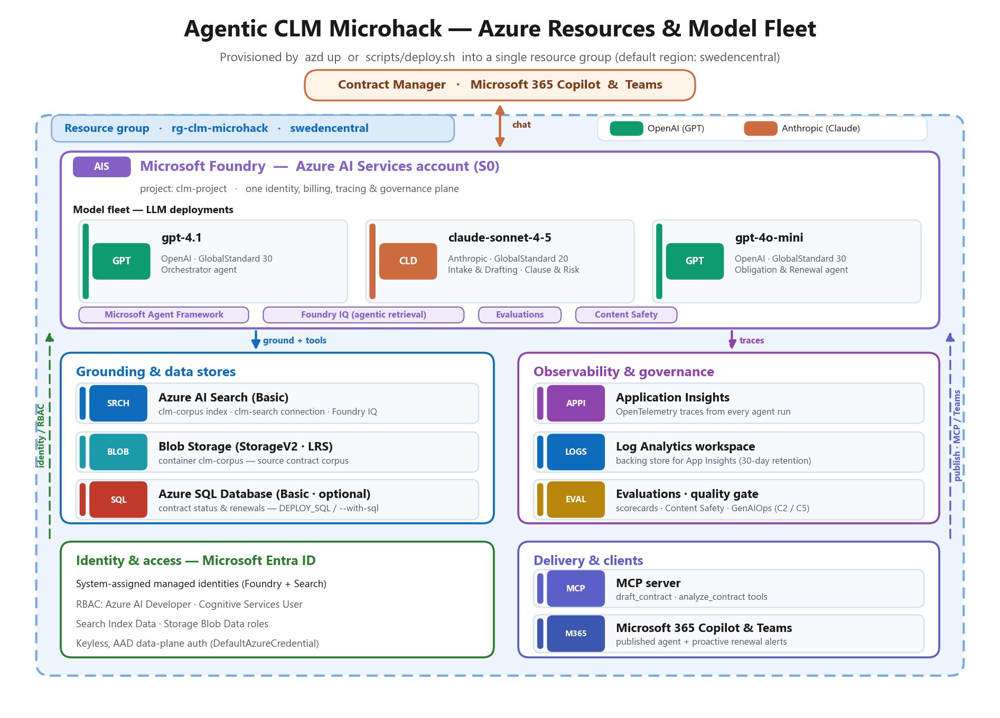

# Challenge 0 · Setup & Foundry Foundations

Welcome to your very first challenge! Here you lay the foundation for the whole microhack: you'll
deploy the Azure resources, wire up your development environment, and seed the contract corpus the
later challenges build on. By the end you'll have the full **Microsoft Foundry** environment
running — with **zero local install** — so the rest of the hack is pure agent-building.

If something isn't working as expected, please let your coach know.

> **⏱️ Duration:** ~30 min

> **📋 Prerequisites:**
> - An **Azure subscription** with rights to create a Foundry project and deploy GPT **and** Anthropic Claude models.
> - A **GitHub account** (to fork the repo and open it in Codespaces).
> - **GitHub Codespaces** access — everything runs in the browser; no local tooling required.

> 🧩 **How to use this challenge:** the provisioning is **scripted for you** (`azd up` *or* the
> `scripts/deploy` script). **Run it, then confirm you understand what got created** — the Foundry
> project, the three-model fleet, and the search index the later challenges depend on. Stuck? The
> scripts *are* the answer key.

## 🎯 Objective

- Provision the Azure resources needed for the upcoming challenges into a single resource group.
- Seed the **Contoso Global** contract corpus into Blob Storage + Azure AI Search so **Foundry IQ**
  can ground the agents with **cited** answers.
- Smoke-test the environment so you *know* both a GPT and the Claude deployment run before you build.

## 🧭 Context and Background

Everything runs from **GitHub Codespaces** using the devcontainer in this repo (Python 3.11, Azure
CLI, `azd`, Node). A single command — **`azd up`** (Bicep in [`infra/`](./infra/)) or the
**`scripts/deploy`** script — provisions everything below into **one resource group** and autofills
your `.env`.

The following image illustrates the complete setup — every Azure resource, the LLM model fleet, and
the identity + delivery plane around them:



All resources reside in a **single resource group** (default name `rg-clm-microhack`, region
`swedencentral`):

- A **Microsoft Foundry** account (Azure AI Services · S0) with a **Foundry project** (`clm-project`)
  — one identity, billing, tracing, and governance plane for the whole system.
- Three **model deployments** — the multi-model fleet the agents run on: **`gpt-4.1`**,
  **`gpt-4o-mini`**, and **`claude-sonnet-4-5`** (Claude is GA in Microsoft Foundry).
- **Azure AI Search** (Basic) — the backing store for the **Foundry IQ** knowledge base (`clm-corpus`
  index, `clm-search` connection).
- **Blob Storage** (StorageV2 · LRS) — the source contract corpus (`clm-corpus` container).
- **Application Insights** + a **Log Analytics** workspace — OpenTelemetry tracing (Challenge 2).
- *(Optional)* **Azure SQL Database** (Basic) — backs the contract-status / renewal function tool.

Identity is **keyless**: system-assigned managed identities plus Microsoft Entra ID RBAC (Azure AI
Developer, Cognitive Services User, Search + Storage data roles) — all assigned for you by `azd up`.

<details>
<summary><strong>📦 Resource inventory</strong> (what gets created)</summary>

| Resource | Type / SKU | Default name | Purpose |
|----------|------------|--------------|---------|
| Foundry account | Azure AI Services · `S0` | `clmfoundry****` | Hosts the project + model deployments |
| Foundry project | AI Foundry project | `clm-project` | Agents, connections, tracing |
| Azure AI Search | `Basic` | `clmsearch****` | Foundry IQ knowledge base (`clm-corpus` index) |
| Storage account | `StorageV2` · `Standard_LRS` | `clmstor****` | Source corpus (`clm-corpus` container) |
| Application Insights | `web` | `clm-appinsights****` | OpenTelemetry traces |
| Log Analytics | `PerGB2018` | `clm-logs****` | Backing store for App Insights |
| Azure SQL *(optional)* | `Basic` | `clmsql****` | Contract status / renewal dates |

`****` is a short random token so globally-unique names don't collide.

</details>

<details>
<summary><strong>🤖 Model fleet</strong> (the LLM deployments)</summary>

| Deployment | Model · format | SKU | Agent it powers | Challenge |
|------------|----------------|-----|-----------------|-----------|
| `gpt-4.1` | OpenAI `gpt-4.1` (`2025-04-14`) | GlobalStandard · 30 | **Orchestrator** — routing + hand-offs | C3 |
| `claude-sonnet-4-5` | Anthropic `claude-sonnet-4-5` (v`2`, Azure-hosted) | GlobalStandard · 20 | **Intake & Drafting** + **Clause & Risk** | C1, C3 |
| `gpt-4o-mini` | OpenAI `gpt-4o-mini` (`2024-07-18`) | GlobalStandard · 30 | **Obligation & Renewal** — cheap, high-frequency | C3 |

> Specialists run on **Claude** while orchestration runs on **GPT** — all inside **one** Foundry
> project. That's the multi-model fleet you'll build agents on.

</details>

<details>
<summary><strong>📚 CLM corpus</strong> (the data you seed)</summary>

`python scripts/seed_corpus.py` uploads [`data/`](../data/) to Blob and indexes it into Azure AI
Search so Foundry IQ can ground answers with citations:

| Folder | Contents | Used by |
|--------|----------|---------|
| `contract_templates/` | Approved NDA / MSA / SOW templates | Intake & Drafting (C1) |
| `clause_library/` | `standard_clauses.md` — standard positions CL-01…CL-10 | Clause & Risk (C3) |
| `policies/` | Contracting policy (approval thresholds, no-legal-advice rule) | All agents (grounding + guardrails) |
| `counterparty_drafts/` | `acme_msa_draft.md` — an inbound draft full of red flags | Clause & Risk (C3) |
| `evaluation/` | `evaluation_dataset.jsonl` — 16 labelled cases | Evaluation (C2) |

</details>

## ✅ Tasks

### Task 1 · Fork the repository

[Fork this repository](../../../fork) to your GitHub account (the **Fork** button, top-right). This
lets you make changes and save your progress.

---

### Task 2 · Launch the development environment

Open the repo in **GitHub Codespaces**: **Code → Codespaces → Create codespace on `main`**. Wait for
the devcontainer to finish `pip install -r requirements.txt`.

> [!NOTE]
> If GitHub Codespaces is not enabled in your organization, see [enabling or disabling Codespaces](https://docs.github.com/en/codespaces/managing-codespaces-for-your-organization/enabling-or-disabling-github-codespaces-for-your-organization), or create a [free personal GitHub account](https://github.com/signup). The Free plan includes 120 core-hours/month.

> [!TIP]
> While the Codespace builds, skim the [hackathon scenario & architecture](../README.md#the-scenario--contoso-global) so the pieces you deploy here make sense.

---

### Task 3 · Log in to Azure

In the Codespace terminal, sign in and select your subscription:

```bash
az login --use-device-code
az account set --subscription "<your-subscription-id>"
```

---

### Task 4 · Deploy the resources

> [!IMPORTANT]
> Depending on the setup for your event, the Azure resources may already be provisioned for you — in
> which case you can **skip to Task 6**. Check with your coach what applies.

Choose a region that offers **all three** models (check the Foundry model catalog; `swedencentral` is
a good default). Then pick **one** option:

<details>
<summary><strong>Option A — <code>azd up</code></strong> (recommended · Bicep in <code>infra/</code>)</summary>

```bash
azd auth login
azd up          # prompts for an environment name + region, then provisions everything
```

`azd up` deploys the Bicep in [`infra/`](./infra/), assigns the RBAC roles the later challenges need,
creates the `clm-search` Foundry IQ connection, and runs the `postprovision` hook
(`scripts/write_env.py`) to write your `.env`.

To also provision Azure SQL:

```bash
azd env set DEPLOY_SQL true
azd env set SQL_ADMIN_PASSWORD '<StrongP@ssw0rd!>'
azd up
```

</details>

<details>
<summary><strong>Option B — deploy script</strong> (<code>az</code> CLI)</summary>

```bash
LOCATION=swedencentral ./scripts/deploy.sh          # add --with-sql to also provision Azure SQL
```

> Windows (outside Codespaces): `./scripts/deploy.ps1` (`-WithSql` optional).

</details>

Either path writes a populated **`.env`** at the repo root. ⏱️ Provisioning takes ~5–10 minutes.

---

### Task 5 · Verify your resources

Open the [Azure Portal](https://portal.azure.com/), find your resource group, and confirm it contains
the resources from the [inventory above](#-context-and-background) — the Foundry account, the 3 model
deployments, Azure AI Search, Storage, and Application Insights. Then open `.env` at the repo root and
confirm the values are filled in (no empty entries except the Challenge 4 Teams/Bot variables).

> [!CAUTION]
> For convenience, this hackathon uses key-based storage connection strings and public network access.
> **Never commit `.env`** — it's already in [`.gitignore`](../.gitignore). In production, prefer managed
> identities, private endpoints, and Key Vault.

---

### Task 6 · Seed the corpus

Upload `data/` to Blob and build the `clm-corpus` search index:

```bash
python scripts/seed_corpus.py
# optional — only if you deployed Azure SQL:
python scripts/seed_sql.py
```

> [!NOTE]
> The corpus mixes **Markdown** (Contoso-authored templates, clause library, policy) with **PDF
> contracts** — 5 executed contracts in `data/contracts/` (one per row seeded into Azure SQL) plus the
> inbound `acme_msa_draft.pdf`. `seed_corpus.py` extracts PDF text with **pypdf** so both formats land
> in the same index for Foundry IQ. To rebuild the PDFs from source, see
> [`data/README.md`](../data/README.md#regenerating-the-contract-pdfs).

---

### Task 7 · Smoke test

Prove the project is reachable and that **both** a GPT and the Claude deployment run:

```bash
python scripts/smoke_test.py
```

🎉 If it prints **✅ PASS**, your Foundry CLM environment is ready.

## ✔️ Success criteria

- `.env` is populated (project endpoint + connection strings).
- `python scripts/smoke_test.py` prints **✅ PASS** — a tiny agent runs on **both** `gpt-4.1` and
  `claude-sonnet-4-5`.
- In the Foundry portal you can see the project, the 3 model deployments, and the `clm-corpus` index
  with documents.

Expected smoke-test output:

```
1) Checking environment…            ✓ (all vars present)
2) Pinging gpt deployment 'gpt-4.1'… ✓ gpt replied: OK
2) Pinging claude deployment 'claude-sonnet-4-5'… ✓ claude replied: OK
Smoke test: ✅ PASS
```

## 🚀 Go Further

> [!NOTE]
> Finished early? These are **optional** — feel free to move on and come back later.

- Inspect the **Bicep** in [`infra/`](./infra/) (`main.bicep` + `resources.bicep`) — it mirrors
  `deploy.sh` and is what `azd up` runs. Try `azd provision --preview` for a what-if before deploying.
- Regenerate this challenge's resource diagram: `python scripts/make_challenge0_resources.py`.
- Add a **US Data Zone** deployment tier for data-residency, or scope RBAC to least privilege.
- Deploy `claude-haiku-4-5` too and compare it against `gpt-4o-mini` for the renewal agent later.

## 🛠️ Troubleshooting

| Symptom | Fix |
|---------|-----|
| `deployment failed` for a model | The model/version isn't available in your region. Try `eastus2`/`westus3`, or adjust the version in `scripts/deploy.sh`. Check the Foundry catalog. |
| `account project create` unavailable | The CLI project command is preview. Create the project in the **Foundry portal**, then set `AZURE_AI_PROJECT_ENDPOINT` in `.env` manually (Overview → Endpoint). |
| Claude ping fails in smoke test | Claude may not be enabled in the **Agent runner** for your region yet. You can still proceed — Challenge 1 documents an Anthropic-SDK fallback. |
| `az login` in Codespaces | Use `az login --use-device-code`. |
| Search / quota errors | Ensure the subscription has quota for Basic Search + the model SKUs; request quota if needed. |
| `PermissionDenied` after deploy | RBAC can take 5–10 min to propagate. Wait, run `az login --use-device-code` again, and retry. |

<details>
<summary>Re-run seeding or check the search index</summary>

```bash
# seed_corpus.py is idempotent — safe to re-run
python scripts/seed_corpus.py

# confirm the index has documents
az search service show --name <clmsearch****> --resource-group rg-clm-microhack --query name
```

</details>

## 🧠 Reflection

- Why keep the corpus in Blob **and** an Azure AI Search index? *(Source of truth vs. retrieval.)*
- The fleet mixes GPT and Claude in one project. What does Foundry give you that stitching two vendor
  APIs together would not? *(One identity, billing, tracing, and governance plane.)*
- The deploy assigns **data-plane** roles (Search Index Data, Storage Blob Data) to a **managed
  identity** rather than using keys. Why does that matter for an enterprise CLM system?

## 📚 Learn more

- [Microsoft Foundry](https://learn.microsoft.com/azure/ai-foundry/)
- [Foundry Agent Service](https://learn.microsoft.com/azure/ai-foundry/agents/overview)
- [Foundry IQ / agentic retrieval](https://learn.microsoft.com/azure/search/search-agentic-retrieval-concept)
- [Azure AI Search](https://learn.microsoft.com/azure/search/)
- [Azure Developer CLI (`azd`)](https://learn.microsoft.com/azure/developer/azure-developer-cli/)

---

➡️ Next: **[Challenge 1 — Intake & Drafting agent + Foundry IQ + tools](../challenge-1/)**
