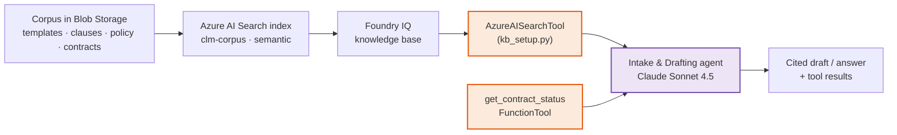

# Challenge 1 · Grounded Agent with Foundry IQ + Tools

Welcome to your first agent! In Challenge 0 you provisioned Microsoft Foundry and seeded the
**Contoso Global** contract corpus. Now you'll turn that corpus into a working assistant: the
**Intake & Drafting agent** — a grounded, cited, tool-enabled, guard-railed agent that drafts
contracts from approved templates and answers policy questions **with sources**. It runs on
**Anthropic Claude Sonnet 4.5**, and the twist you'll internalize here is that grounding it on Claude
takes the *exact same code* as grounding it on GPT — because Foundry is a **model-agnostic control
plane**.

If something isn't working as expected, please let your coach know.

> **⏱️ Duration:** ~60 min

> **📋 Prerequisites:**
> - **Challenge 0 complete** — `.env` populated, corpus seeded into Azure AI Search, smoke test green.
> - A model deployment for **`claude-sonnet-4-5`** (created in Challenge 0) reachable from your project.

> 🧩 **How to use this challenge:** the code in this folder is a **complete, working reference
> implementation** — you're not building it from a blank file. **Run it, read it, and understand *why*
> it works**, then take it further with **🚀 Go Further**. Stuck? The code *is* the answer key.

---

## 🎯 Objective

Build the **Intake & Drafting agent** on **Anthropic Claude Sonnet 4.5** and make it:

- **Grounded** — every substantive answer is drawn from the CLM corpus via **Foundry IQ**, not the
  model's parametric memory.
- **Cited** — answers reference the source documents they came from.
- **Tool-enabled** — a **function tool** (`get_contract_status`) performs structured lookups the model
  must not guess.
- **Guard-railed** — the agent **refuses** to give legal advice and flags policy deviations for human
  review.

## 🧩 What you'll build

| Component | What it is | Where it lives |
|-----------|-----------|----------------|
| **Knowledge tool (Foundry IQ)** | An `AzureAISearchTool` over the `clm-corpus` index — grounds the agent on Contoso's templates, clauses, policy and contracts | [`kb_setup.py`](kb_setup.py) → `build_knowledge_tool()` |
| **Function tool** | `get_contract_status(contract_id)` — deterministic lookup of status, renewal date, risk and owner (Azure SQL, falling back to seed JSON) | [`src/clm_common/tools.py`](../src/clm_common/tools.py) |
| **Guard-railed persona** | Instructions that force citations, forbid invented terms, and refuse legal advice | `INSTRUCTIONS` in [`agents/intake_drafting_agent.py`](agents/intake_drafting_agent.py) |
| **Claude-backed agent** | The same Agents API as GPT, with `model` pointed at the Claude deployment | `create_agent()` in [`agents/intake_drafting_agent.py`](agents/intake_drafting_agent.py) |
| **A repeatable demo** | Creates the agent, runs four prompts (draft · cited Q&A · tool call · refusal), then cleans up | `main()` in [`agents/intake_drafting_agent.py`](agents/intake_drafting_agent.py) |

## 🧭 Context and Background

### How grounding works — the Foundry IQ chain

**Foundry IQ** is how you ground an agent on *your* knowledge. You never hand the model a pile of
documents; instead you attach a **knowledge base** as a **tool**, and the agent performs **agentic
retrieval** — it plans sub-queries, searches, reranks, and returns **cited** passages — during a run.



The index itself was built in **Challenge 0** by `scripts/seed_corpus.py`. In this challenge you
simply **attach it** as a tool and let the agent retrieve from it.

### Two kinds of tools

An agent grounds and acts through **tools**. This agent has both flavors:

- **Knowledge tool** (`AzureAISearchTool`) — for *unstructured* knowledge: "what does our standard
  limitation-of-liability clause say?" Answered from the corpus, **with citations**.
- **Function tool** (`get_contract_status`) — for *structured* facts the model must never hallucinate:
  "what's the renewal date of `CT-4821`?" The Agents SDK generates the tool's JSON schema **from the
  Python type hints + docstring**, and `enable_auto_function_calls(...)` runs the function
  automatically mid-run.

> [!NOTE]
> Because the schema is derived from the function signature and docstring, **keeping good type hints
> and a clear docstring is not optional** — they *are* the tool contract the model sees.

### Why Claude here — and why the API doesn't change

Drafting rewards strong instruction-following and long-context legal reasoning, so the Intake &
Drafting agent runs on **Claude Sonnet 4.5** (`MODEL_DRAFTING`). The whole point of Foundry as a
control plane is that you get there by pointing `model` at the Claude deployment — **the
agent/tool/grounding API is identical across providers**. The same `create_agent(...) → ToolSet →
run` shape hosts a GPT agent (you'll see that in Challenge 3's orchestrator) with no other changes.

### Guardrails at the prompt layer

The `INSTRUCTIONS` block encodes Contoso's policy: never invent legal terms, always cite, call the
tool for contract facts, and **refuse legal advice** (recommend qualified counsel instead). That's
the first line of defense; content-safety policies (Challenge 5) add a second, independent one.

### The knowledge base — what actually grounds the agent

Everything the agent "knows" comes from the corpus you seeded in Challenge 0:

| Corpus source | Contents | Role in Challenge 1 |
|---------------|----------|---------------------|
| [`challenge-0/data/contract_templates/`](../challenge-0/data/contract_templates/) | Approved **NDA / MSA / SOW** templates (PDF) | Drafting source — the agent fills placeholders, never invents terms |
| [`challenge-0/data/clause_library/`](../challenge-0/data/clause_library/) | Enterprise-standard positions **CL-01…CL-12** (PDF) | Cited answers about standard clauses (e.g. the liability cap) |
| [`challenge-0/data/policies/`](../challenge-0/data/policies/) | Approval thresholds + the **no-legal-advice** rule (plus a delegation-of-authority matrix) | Grounds policy answers; reinforces the guardrail |
| [`challenge-0/data/contracts/`](../challenge-0/data/contracts/) | **5 executed contract PDFs** (text-extractable) | Grounding + narrative basis for status lookups |
| [`challenge-0/data/contracts_seed.json`](../challenge-0/data/contracts_seed.json) | Structured metadata for the same 5 contracts | Backs `get_contract_status` (SQL fallback) |

### Files in this challenge

| File | What it does |
|------|--------------|
| [`kb_setup.py`](kb_setup.py) | Resolves the project's **default Azure AI Search connection** and builds the `AzureAISearchTool` (the Foundry IQ knowledge base). Run it standalone to verify grounding is wired up. |
| [`agents/intake_drafting_agent.py`](agents/intake_drafting_agent.py) | Defines the agent (persona, guardrails, knowledge + function tools) and runs a four-prompt demo. `--keep` leaves it in the project for later challenges / the portal. |
| [`sample_prompts.md`](sample_prompts.md) | Curated prompts that exercise every capability: grounded drafting, cited Q&A, the function tool, and the refusal guardrail. |

## 🧰 Services & models in this challenge

This agent is small, but it stands on a handful of Azure + Foundry services. Here's **what each one is**
and **why it's in the architecture** — so you can reason about the system, not just run it.

### Microsoft Foundry — Agent Service

**What it is:** the managed **control plane and runtime** for agents. You declare an agent (a model, its
instructions, and its tools) and Foundry hosts it — running the reasoning loop, calling tools, and
managing conversation threads on the server side.

- One project, **many models** (GPT, Claude, …) behind **one identical Agents API**.
- Server-managed **threads, runs and tool orchestration** — you don't hand-roll the agent loop.
- A single home for **connections, model deployments, tracing and governance**.

**Why here:** it lets you build a grounded, tool-using agent on Claude in a few lines of Python — and
swap the model later *without touching* your grounding or tool code. → [Foundry Agent Service](https://learn.microsoft.com/azure/ai-foundry/agents/overview)

### Foundry IQ — agentic retrieval

**What it is:** the **grounding layer**. Instead of stuffing documents into the prompt, you attach a
**knowledge base as a tool**; at run time the agent plans sub-queries, searches, reranks, and returns
**cited** passages — *agentic* retrieval rather than a single similarity lookup.

- **Query planning + reranking** for higher-quality, multi-hop answers.
- **Citations** so every claim is traceable to a source document.
- Decouples *what the agent knows* from *how the model was trained*.

**Why here:** it's what makes the agent answer from **Contoso's corpus, with sources**, instead of the
model's parametric memory. → [Agentic retrieval](https://learn.microsoft.com/azure/search/search-agentic-retrieval-concept)

### Azure AI Search

**What it is:** the **retrieval engine and index** (`clm-corpus`) behind Foundry IQ — full-text, vector
and **semantic** ranking over your documents.

- **Hybrid + semantic ranking** for relevance on legal language.
- Chunked, embedded content built once in **Challenge 0** by `scripts/seed_corpus.py`.
- Exposed to the agent through the `AzureAISearchTool` in [`kb_setup.py`](kb_setup.py).

**Why here:** it's the searchable backing store that Foundry IQ retrieves from — the difference between
"the model guesses" and "the agent cites CL-04". → [Azure AI Search](https://learn.microsoft.com/azure/search/)

### Azure Blob Storage

**What it is:** massively scalable **object storage** — the source of truth for the raw corpus
(templates, clause library, policy, executed contract PDFs) before it's indexed.

- Cheap, durable storage for the documents the agent grounds on.
- The **seed → index** pipeline reads from Blob and writes to Azure AI Search.

**Why here:** it holds the documents you seeded in Challenge 0; Search indexes them so the agent can
retrieve them. → [Azure Blob Storage](https://learn.microsoft.com/en-us/azure/storage/blobs/storage-blobs-introduction)

### Model — Anthropic Claude Sonnet 4.5 (via Foundry Models)

**What it is:** the LLM that powers this agent (`MODEL_DRAFTING = claude-sonnet-4-5`), deployed and
called **through Foundry** exactly like an Azure OpenAI model.

- Strong **instruction-following** and **long-context** reasoning — ideal for legal drafting.
- Reached via the **same Agents API** as GPT (point `model` at the Claude deployment; nothing else
  changes).

**Why here:** drafting rewards careful, structured, policy-abiding writing — Claude's strengths. Routing
and fast tool-calling go to **GPT-4.1** in Challenge 3, proving the platform is **model-agnostic**.
→ [Models in Microsoft Foundry](https://learn.microsoft.com/azure/ai-foundry/)

### Function tools (Agents SDK)

**What it is:** plain **Python functions** exposed to the model as callable tools. The SDK generates each
tool's JSON schema **from your type hints + docstring**, and `enable_auto_function_calls(...)` runs them
automatically mid-run.

- Deterministic, structured actions the model must **never hallucinate** (e.g. `get_contract_status`).
- The **docstring + signature *are* the contract** the model sees — keep them precise.

**Why here:** contract facts (status, renewal date, risk) come from a **lookup**, not a guess — the
knowledge tool grounds *unstructured* answers, this grounds *structured* ones.
→ [Function calling with Foundry agents](https://learn.microsoft.com/en-us/azure/foundry/agents/how-to/tools/function-calling)

## ✅ Tasks

### 1 · Verify the knowledge connection

Confirm the default Azure AI Search connection resolves and the index is present:

```bash
python challenge-1/kb_setup.py
```

Expected output (ids will differ):

```text
✓ Default Azure AI Search connection: /subscriptions/.../connections/clm-search
✓ Index: clm-corpus
✓ Built AzureAISearchTool with 1 tool definition(s).
```

> [!TIP]
> If the connection doesn't resolve, it's almost always a Challenge 0 gap — see **Troubleshooting**.

### 2 · Read the agent definition

Open [`agents/intake_drafting_agent.py`](agents/intake_drafting_agent.py) and trace how it's wired:

- `model=settings.model_drafting` → **Claude Sonnet 4.5** (the only line that would change for GPT).
- The persona + **refusal** instructions in `INSTRUCTIONS`.
- Grounding via `build_knowledge_tool(project)` **plus** the `get_contract_status` **FunctionTool**,
  combined in a single `ToolSet`.
- `enable_auto_function_calls(toolset)` so the function runs automatically during a run.

<details>
<summary><strong>🔬 Anatomy of the agent</strong> — the wiring in ~15 lines</summary>

```python
from azure.ai.agents.models import FunctionTool, ToolSet
from kb_setup import build_knowledge_tool
from clm_common.tools import get_contract_status

knowledge = build_knowledge_tool(project)          # AzureAISearchTool over clm-corpus
functions = FunctionTool(functions={get_contract_status})

toolset = ToolSet()
toolset.add(knowledge)                             # unstructured grounding (Foundry IQ)
toolset.add(functions)                             # structured lookups
project.agents.enable_auto_function_calls(toolset) # run local functions mid-run

agent = project.agents.create_agent(
    model=settings.model_drafting,                 # ← "claude-sonnet-4-5"; swap for a GPT id, nothing else changes
    name="intake-drafting-agent",
    instructions=INSTRUCTIONS,                      # persona + citations + refusal policy
    toolset=toolset,
)
```

A single run then does: post a user message → `runs.create_and_process` (the agent plans, retrieves,
optionally calls `get_contract_status`, and drafts) → read back the last assistant message. That
`run_prompt` helper lives in [`src/clm_common/foundry.py`](../src/clm_common/foundry.py).
</details>

### 3 · Run the agent end-to-end

This creates the agent, runs four demo prompts on one thread, then deletes it:

```bash
python challenge-1/agents/intake_drafting_agent.py

# ...or keep it for later challenges / the portal Playground:
python challenge-1/agents/intake_drafting_agent.py --keep
```

The four built-in prompts deliberately cover all four behaviors — a **draft**, a **cited** clause
Q&A, a **`CT-4821` status** lookup (function tool), and a **legal-advice** prompt that must be
**refused**.

> [!NOTE]
> With `--keep`, the script prints the agent id. Set `INTAKE_AGENT_ID=<id>` in your `.env` so later
> challenges (and the portal) can reuse it instead of recreating one.

### 4 · Exercise every capability

Work through [`sample_prompts.md`](sample_prompts.md) — via the demo script, the portal **Playground**,
or your own thread. Each section maps to one capability, and the file's *"What good looks like"* table
tells you the expected behavior:

| Prompt type | Expected behavior |
|-------------|-------------------|
| **Drafting** | Uses the approved template structure; fills only provided details; **no invented terms** |
| **Cited Q&A** | Answer grounded in the corpus **with citations**; says "not in corpus" if unknown |
| **Function tool** | Calls `get_contract_status`; returns **real fields** for `CT-4821` |
| **Legal advice** | **Brief refusal** + recommends qualified counsel |

For the tool call, `CT-4821` should come back with concrete, structured data — for example:

```json
{"contract_id": "CT-4821", "counterparty": "Acme Corp", "type": "MSA",
 "status": "Active", "renewal_date": "2026-09-01", "auto_renew": true,
 "notice_days": 90, "risk": "High", "owner": "legal@contoso.com",
 "_note": "(source: contracts_seed.json)"}
```

### 5 · (Optional) Add content safety

In the portal, attach **Prompt Shields / PII** guardrails to the agent, or discuss where they'd sit.
The refusal instructions already enforce the no-legal-advice policy at the prompt layer — content
safety adds a second, model-independent layer (previewed here, built in **Challenge 5**).

### ⚙️ Claude fallback (if the Agent runner can't host Claude in your region)

The **preferred** path is `model="claude-sonnet-4-5"` on `create_agent`, exactly like GPT. If that run
fails because the Agent Service runner doesn't yet support Anthropic models in your region, call Claude
**directly** through Foundry with the Anthropic SDK and keep grounding/tools in your own code:

```python
from anthropic import AnthropicFoundry           # pip: anthropic (already in requirements.txt)
from clm_common.config import settings, credential

token = credential().get_token("https://cognitiveservices.azure.com/.default").token
client = AnthropicFoundry(
    base_url=settings.project_endpoint.split("/api/projects")[0],   # the AI Services endpoint
    api_key=token,                                                  # Entra token as bearer
)
msg = client.messages.create(
    model=settings.model_drafting,
    max_tokens=1024,
    messages=[{"role": "user", "content": "Draft a mutual NDA…"}],
)
print(msg.content[0].text)
```

You'd then do retrieval (Azure AI Search) and the contract-status lookup yourself and pass the results
into the prompt. Prefer the native agent path when available — this is only a safety net.

## ✔️ Success criteria

You're done when:

- [ ] `python challenge-1/kb_setup.py` prints the Search connection id **and** the `clm-corpus` index.
- [ ] Cited answers are drawn from the corpus (you can see the source documents).
- [ ] The `get_contract_status` tool is invoked for `CT-4821` and returns real fields.
- [ ] The legal-advice prompt is **refused** with a recommendation to consult counsel.
- [ ] The agent is running on the **Claude** deployment (confirm the model name in the portal).

## 🚀 Go Further

- Add a **Web IQ (Bing)** grounding tool for external / regulatory lookups.
- Add a second knowledge base scoped to a single contract type and compare retrieval quality.
- Tighten the persona so every draft includes a **"⚠️ requires human review"** banner.
- Add a second function tool (e.g. `list_upcoming_renewals`, already in `clm_common.tools`) and watch
  the model choose between tools.

## 🛠️ Troubleshooting

| Symptom | Fix |
|---------|-----|
| `get_default(AZURE_AI_SEARCH)` returns nothing | Ensure Challenge 0 created the Search resource and connected it to the project (**portal → Connected resources**). Set `AZURE_SEARCH_CONNECTION_NAME` in `.env`. |
| No citations returned | Confirm `scripts/seed_corpus.py` populated the index and the semantic config exists; try raising `top_k` in `build_knowledge_tool`. |
| Function tool never called | Keep the docstring + type hints (the schema comes from them); ensure `enable_auto_function_calls(toolset)` ran and the prompt actually asks for a specific contract. |
| `get_contract_status` says "not found" | Use a known id (`CT-4821`, `CT-3390`, `CT-5102`, `CT-2765`, `CT-6033`) — the error message lists them. |
| Run status `failed` on Claude | Your region's Agent runner may not host Anthropic models yet — use the **Claude fallback** above. |
| `Missing required environment variable 'AZURE_AI_PROJECT_ENDPOINT'` | Re-run Challenge 0's deploy (which writes `.env`) or copy `.env.example` → `.env` and fill it in. |

## 🎯 What you accomplished

You built your first **grounded, cited, tool-using, guard-railed agent** — and did it on **Claude**
with the same API you'll use for GPT.

**Key achievements:**

- **Grounded on your corpus** — attached the Foundry IQ knowledge base as a tool so answers come from
  Contoso's documents, with citations, not model memory.
- **Mixed knowledge + function tools** — combined unstructured retrieval with a deterministic
  `get_contract_status` lookup in one `ToolSet`, auto-invoked mid-run.
- **Enforced guardrails** — the agent refuses legal advice and flags policy deviations for a human.
- **Proved model-agnosticism** — ran the whole thing on Claude Sonnet 4.5 by changing a single
  `model` argument.

This agent becomes a building block later: the **orchestrator** (Challenge 3) will delegate drafting
to it, and everything it does will be **traced and evaluated** in Challenge 2.

## 📚 Learn more

- [Microsoft Foundry](https://learn.microsoft.com/azure/ai-foundry/)
- [Foundry Agent Service](https://learn.microsoft.com/azure/ai-foundry/agents/overview)
- [Function calling with Foundry agents](https://learn.microsoft.com/en-us/azure/foundry/agents/how-to/tools/function-calling)
- [Foundry IQ / agentic retrieval](https://learn.microsoft.com/azure/search/search-agentic-retrieval-concept)
- [Azure AI Search](https://learn.microsoft.com/azure/search/)

## 🧠 Reflection

- Why put **drafting** on Claude and **routing** on GPT? (Instruction-following & long-context legal
  reasoning vs. fast, deterministic tool-calling.)
- Where should guardrails live — in the prompt, as a content-safety policy, or both? What does each
  catch that the other misses?
- When should a fact come from a **function tool** vs. **retrieval**? What breaks if you let the model
  guess contract metadata?

---

⬅️ Back: **[Challenge 0 — Setup & Foundry Foundations](../challenge-0/)** ·
➡️ Next: **[Challenge 2 — Observability, Tracing & Evaluation](../challenge-2/)**
