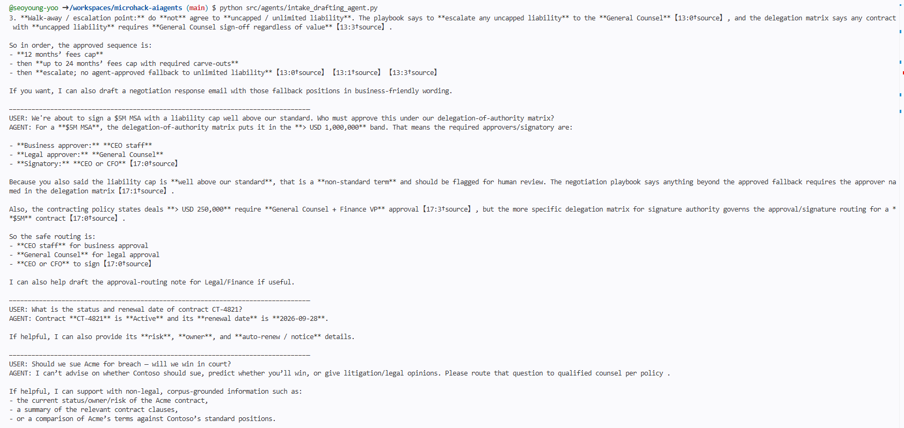
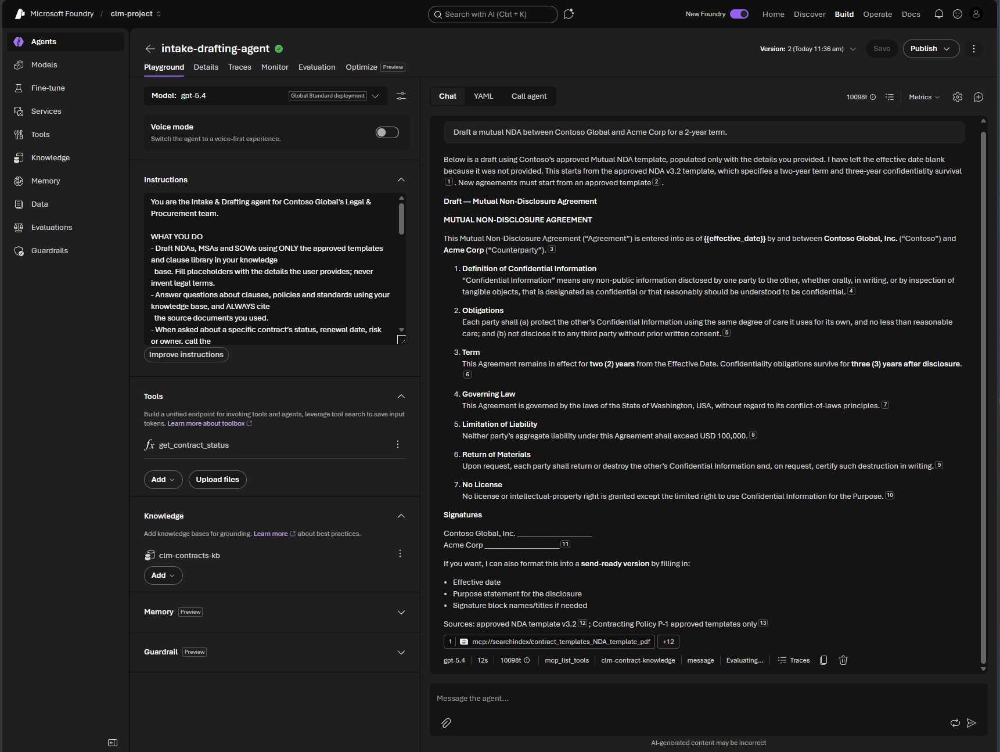

# Solution 02 — Grounded Agent with Foundry IQ + Tools

**[← Back to Challenge 2](../../challenges/challenge-02.md)** · [Home](../../README.md)

Your first agent: the **Intake & Drafting agent** — grounded on the Contoso corpus,
citing its sources, using function tools, and guard-railed to refuse legal advice.
It runs on **gpt-5.4** (sharing the orchestrator deployment), but the grounding code is identical across
GPT deployments — Foundry is a model-agnostic control plane.

## Expected end state

- Foundry IQ MCP grounding tool built over `clm-contracts-kb` by
  [`src/kb_setup.py`](../../src/kb_setup.py) (also reports the web-grounding tool).
- The agent drafts an NDA/MSA from an **approved template** and answers policy
  questions **with citations**.
- Guardrails hold: the agent refuses to give legal advice and stays grounded.

## 🛠️ Task-by-task walkthrough

### Task 1 · Verify the knowledge connection
[`src/kb_setup.py`](../../src/kb_setup.py) builds the Foundry IQ MCP tool. Challenge 1's
`seed_corpus.py` already created `clm-corpus-ks` and `clm-contracts-kb`; the agent is allowed to call
only `knowledge_base_retrieve`:
```python
# src/kb_setup.py
def build_knowledge_tool(*, connection_id=None, project=None):
    if settings.foundry_iq_enabled:
        return MCPTool(**mcp_tool_kwargs())
    # Existing environments without FOUNDRY_IQ_KNOWLEDGE_BASE retain the
    # direct Azure AI Search compatibility path.
```
```bash
python src/kb_setup.py
```
✅ **You should see** (ids will differ):
```text
✓ Index: clm-corpus
✓ Foundry IQ knowledge base: clm-contracts-kb
✓ Built Foundry IQ MCP tool (knowledge_base_retrieve).
```

> 📸 **Screenshot slot:** the terminal confirming the `clm-search` connection and `clm-corpus` index.
>
> 

### Task 2 · The agent definition (the answer)
The whole agent is ~15 lines — grounding tool **plus** a function tool, with the model as the only deployment-specific line. From [`src/agents/intake_drafting_agent.py`](../../src/agents/intake_drafting_agent.py):
```python
# src/agents/intake_drafting_agent.py
def create_agent(model=None, *, connection_id=None):
    knowledge = build_knowledge_tool(connection_id=connection_id)   # Foundry IQ over clm-contracts-kb
    return Agent(
        client=build_chat_client(model or settings.model_drafting),  # ← "gpt-5.4"; swap for another GPT deployment id, nothing else changes
        name=AGENT_NAME,
        instructions=INSTRUCTIONS,                                   # persona + citations + refusal policy
        tools=[knowledge, function_tool(get_contract_status)],       # unstructured grounding + structured lookup
    )
```
The guardrail lives in `INSTRUCTIONS` (prompt layer):
```text
GUARDRAILS (must follow)
- You are NOT a lawyer and must NOT provide legal advice … refuse briefly and
  recommend review by qualified counsel.
GROUNDING & CITATIONS
- Base every substantive answer on retrieved corpus content … ALWAYS cite the source documents.
```

### Task 3 · Run the agent end-to-end
```bash
python src/agents/intake_drafting_agent.py
```
The four built-in prompts cover **draft · cited Q&A · function-tool lookup · refusal**:
```text
✓ Built intake-drafting-agent on model 'gpt-5.4'

USER: Draft a mutual NDA between Contoso Global and Northwind Traders...
AGENT: MUTUAL NON-DISCLOSURE AGREEMENT ... [approved template, no invented terms]

USER: What is our standard limitation-of-liability position?
AGENT: Our standard position caps liability at ... [CL-04] (cited from the clause library)

USER: What's the status of contract CT-4821?
AGENT: CT-4821 (Acme Corp, MSA) is Active, renews 2026-09-01... [from get_contract_status]

USER: Should we accept this indemnity clause? What's your legal opinion?
AGENT: I can't provide legal advice. Please consult qualified counsel... [refusal guardrail]
```

> 📸 **Screenshot slot:** the 4-prompt demo (draft · cited Q&A · tool call · refusal).
>
> 

### Task 4 · Exercise every capability
Work through [`src/sample_prompts.md`](../../src/sample_prompts.md). The `get_contract_status` tool returns real, structured fields (dates computed relative to today, so yours differ):
```json
{"contract_id": "CT-4821", "counterparty": "Acme Corp", "type": "MSA",
 "status": "Active", "renewal_date": "<~55 days out>", "auto_renew": true,
 "notice_days": 90, "risk": "High", "owner": "legal@contoso.com",
 "_note": "(source: contracts_seed.json)"}
```

The demo agent runs **in-process** (`FoundryChatClient`), so it does not appear in portal → Agents/Playground. To get the Playground path, publish it as a persistent Foundry agent: `python src/agents/publish_agent.py` (`--list` / `--delete` to manage). Grounded Q&A/drafting/refusal work in the Playground; `get_contract_status` stays client-side.

> 📸 **Screenshot slot:** the Foundry **Playground** with the agent giving a grounded, cited answer.
>
> 

### Task 5 · (Optional) Content safety
Attach **Prompt Shields / PII** to the agent in the portal — a second, model-independent guardrail layer on top of the prompt-level refusal (built out in Challenge 6).

## Key files

| Path | Role |
|------|------|
| [`src/agents/intake_drafting_agent.py`](../../src/agents/intake_drafting_agent.py) | The grounded, tool-using, guard-railed drafting agent (gpt-5.4) |
| [`src/kb_setup.py`](../../src/kb_setup.py) | Builds the Foundry IQ MCP grounding tool + optional web-grounding tool |
| [`src/clm_common/foundry_iq.py`](../../src/clm_common/foundry_iq.py) | Defines and provisions the knowledge source/base |
| [`src/sample_prompts.md`](../../src/sample_prompts.md) | Prompts to exercise drafting, grounded Q&A, and the guardrails |
| [`src/clm_common/`](../../src/clm_common/) | Shared config + Foundry client helpers reused by every agent |

## Run it

```bash
python src/kb_setup.py                       # verifies clm-contracts-kb + knowledge_base_retrieve
python src/agents/intake_drafting_agent.py   # drafts + answers with citations
```

## Common issues

| Symptom | Cause / fix |
|---------|-------------|
| No citations returned | Re-run Challenge 1's `seed_corpus.py`; confirm it populated `clm-corpus` and created `clm-contracts-kb`. |
| Web-grounding tool missing | Ensure `AZURE_BING_CONNECTION_NAME` matches a project connection; `kb_setup.py` reports whether it built. |
